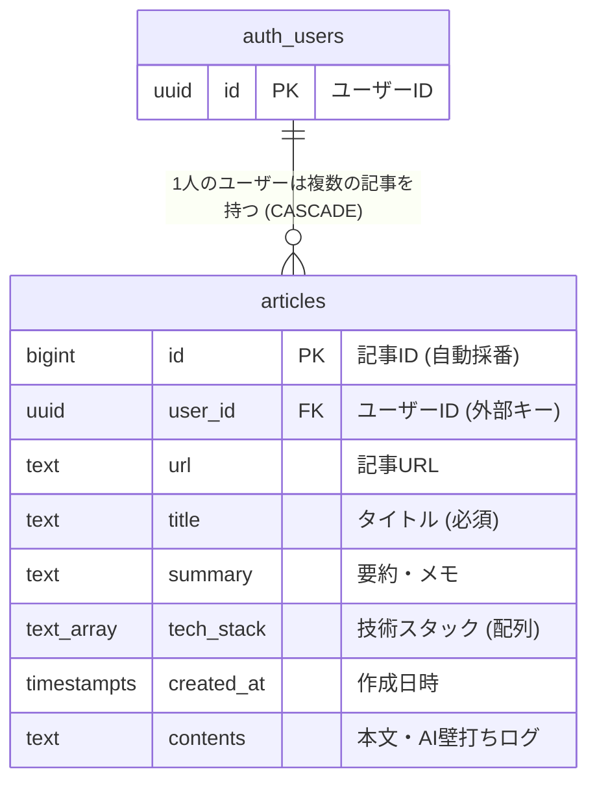

# 📝 Dev Note (技術ノート & AI壁打ちダッシュボード)

## プロジェクトの概要
このプロジェクトは、日々の開発で得た知見や技術記事、ChatGPT等のAIとの壁打ちログを効率的にストック・管理できる個人開発のフルスタックアプリです。</br>
Next.js (App Router) と Supabase (PostgreSQL) を用いて設計・構築しており、URLからのタイトル自動推測機能や、AI（Groq / Llama）を活用した自動要約・自動タグ生成機能、Markdown形式によるコードブロックのシンタックスハイライトなど、開発者にとって実用的な機能を備えています。

Supabase の Row Level Security (RLS) による堅牢なアクセス制御や、Vercelによる継続的デプロイメント（CD）環境など、実運用を意識したモダンな構成で開発しています。


## 本番環境（Vercel）
[https://dev-note-863vzjz9a-yun0312s-projects.vercel.app](https://dev-note-beta.vercel.app/)

###  動作確認用アカウント
アプリの機能をすぐにお試しいただけるデモ用アカウントです。
* **Email:** `test_user@example.com`
* **Password:** `password`

## 💡 こだわり・実装の工夫点

### 1. AI（Groq API）を活用した自動要約・自動タグ生成
* 単なるリンク保存ツールではなく、AI（Groq / Llama 3.3）の Structured Outputs (Zod連携) を活用し、ペーストされたテキストやURLから「記事の要約」や「適切な技術スタック（タグ）」を自動生成する機能を実装しています。これにより、情報の整理にかかる手間を大幅に削減しています。

### 2. 開発者向けの快適なMarkdown & シンタックスハイライト
* 保存したノートやAIとのやり取りはMarkdown形式で美しく整形され、コードブロックにはシンタックスハイライトを適用。長文の技術メモでも視認性を高く保てるUI/UXにこだわっています。

### 3. タグによるリアルタイム絞り込み検索
* 登録された技術スタック（Next.js, TypeScript, Supabase など）から重複のないタグ一覧を動的に抽出し、ワンクリックで瞬時に記事を絞り込めるリアルタイムフィルタリング機能を実装しています。

### 4. Supabase RLS（行レベルセキュリティ）によるデータ保護
* データベース側で Row Level Security (RLS) を有効化し、認証済みの本人（auth.uid()）が所有するデータのみを安全に読み書きできるポリシーを構築しています。


## 環境構築（Next.js）
  1. リポジトリをクローンし、プロジェクトフォルダに移動
``` bash
git clone https://github.com/yun-0312/dev-note.git
cd dev-note
```
  2. 依存関係のインストール
``` bash
npm install
```
 3. 環境変数ファイル（.env.local）の作成
 プロジェクトルートに .env.local を作成し、SupabaseおよびGroqの認証情報を設定します。
``` bash
NEXT_PUBLIC_SUPABASE_URL=あなたのSupabaseプロジェクトURL
NEXT_PUBLIC_SUPABASE_ANON_KEY=あなたのSupabaseAnonKey
GROQ_API_KEY=あなたのGroqAPIキー
```
  4. 依存関係のインストール
``` bash
npm run dev
```
ブラウザで http://localhost:3000 にアクセスして動作を確認できます。


## 実装機能一覧
*  認証機能: 会員登録、ログイン / ログアウト（Supabase Auth）
* 記事・ノート管理 (CRUD):
・記事の新規登録、編集、削除<br />
・URLからの自動タイトル推測機能<br />
・AIによる自動要約・タグ付け機能<br />
* 検索・絞り込み:タグ別でのリアルタイムフィルター検索
* UI / プレビュー: Markdown形式のメモ管理 ＆ コードブロック対応
* バリデーション: クライアント側での堅牢な入力チェック（空欄防止・URL形式チェックなど）


## 使用技術
          <br />
  ・Frontend: Next.js 14/15 (App Router) / React / TypeScript / Tailwind CSS / Lucide Icons<br />
・Backend / DB: Supabase (PostgreSQL / Auth / Row Level Security)<br />
  ・AI Integration: AI SDK / Groq (openai/gpt-oss-120b) <br />
  ・Deployment: Vercel (CI/CD)<br />

## ダッシュボード
https://github.com/user-attachments/assets/1251f25a-b27d-4763-a7a7-1c86fa22cfa2


## ER図

* リレーションシップ: Supabaseの認証機能（auth.users）と articles テーブルを user_id で1対多（1:N）に結んでおり、ユーザーが退会した際には紐づく記事も自動削除されるカスケード削除（on delete CASCADE）を採用しています。

* パフォーマンス考慮: ユーザーごとの記事一覧を高速に取得・絞り込みできるよう、user_id に対して B-tree インデックス（idx_articles_user_id）を付与しています。

* データ型: 技術スタック（tech_stack）に PostgreSQL の配列型（text[]）を採用することで、複数の技術タグを効率的に保持・検索できるようにしています。

* RLSポリシー
```Sql
alter policy "ユーザーは自分のデータだけ参照・追加・削除"
on "public"."articles"
to public
using (
  (auth.uid() = user_id)
) with check (
  (auth.uid() = user_id)
);
```

## URL
・Vercel本番環境：[https://dev-note-863vzjz9a-yun0312s-projects.vercel.app](https://dev-note-beta.vercel.app/)
